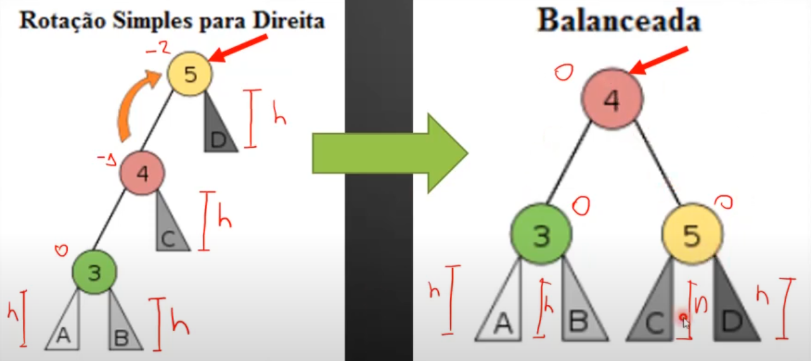
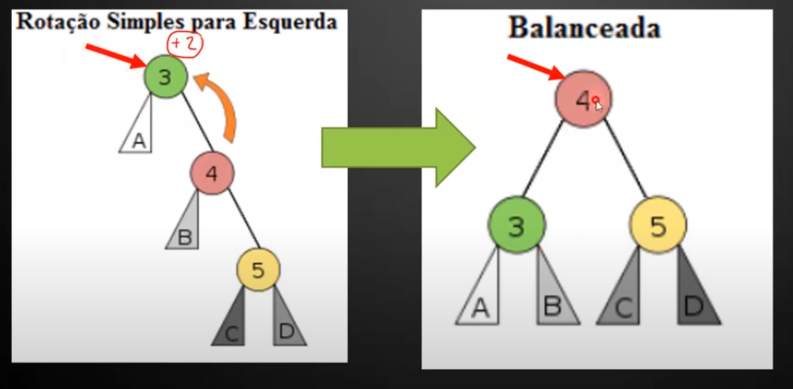
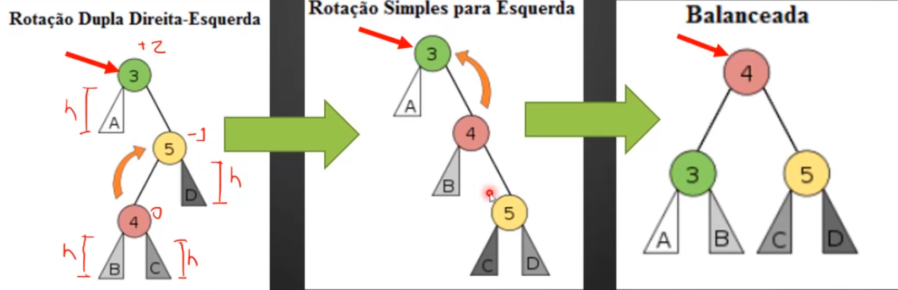
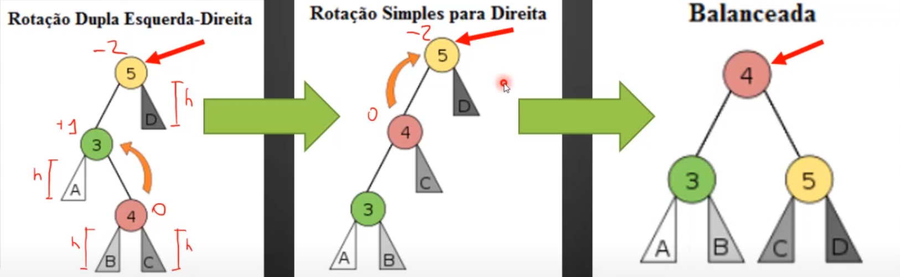

# ÁRVORE AVL
São um tipo de árvore binária de busca auto-balanceada, onde o fator de balanceamento deve estar entre -1 e 1. 
Isso garante que as funções de busca sejam mais eficientes, mas, em contra partida, as funções de inserção e remoção ficam mais custosas.

## Fator de balanceamento
É a diferença entre as subárvores da direita e da esquerda, ou seja, dado por: Fb = hD - hE.
Onde hD é a altura da subárvore à direita do nó e hE é a altura da subárvore à esquerda.
Quando um nó atinge o fator de balanceamento 0, todos os nós pais não mudarão o fator de balanceamento.

## Rotações

### Rotação simples para direita
Se o pai tiver FB = -2 e o filho FB = -1, será rotação para direita.

1. Promover o filho esquerdo da raiz desbalanceada
- O nó que está desbalanceado (chamado de pai) tem um filho à esquerda. Esse filho será promovido para se tornar a nova raiz da subárvore.

2. Reorganizar a subárvore direita do novo pai
- O nó promovido pode ter um filho à direita. Como a árvore segue a propriedade da ordem binária de busca, esse filho precisa ser realocado antes de concluir a rotação.
- Esse filho direito do nó promovido será atribuído como o novo filho esquerdo do nó que antes era a raiz desbalanceada.

3. Rebaixar o nó desbalanceado para a posição de filho direito
- Agora que o filho direito do nó promovido foi realocado, o nó desbalanceado precisa ser reposicionado corretamente. Ele se torna o filho direito do novo pai.

### Rotação simples para esquerda
Se o pai tiver FB = +2 e o filho FB = +1, será rotação para esquerda.

1. Promover o filho direito da raiz desbalanceada
- O nó desbalanceado (nó 3) tem um filho à direita (4). Esse nó será promovido para se tornar a nova raiz da subárvore.

2. Reorganizar a subárvore esquerda do novo pai
- O nó promovido (4) pode ter um filho à esquerda (B). Esse filho precisa ser realocado para manter a propriedade da árvore binária de busca.
- O filho esquerdo do nó promovido será atribuído como o novo filho direito do nó que antes era a raiz desbalanceada (3).

3. Rebaixar o nó desbalanceado para a posição de filho esquerdo
- Agora que o filho esquerdo do nó promovido foi realocado, o nó desbalanceado (3) precisa ser reposicionado corretamente. Ele se torna o filho esquerdo do novo pai (4).

### Rotação dupla direita-esquerda
As duplas rotações acontecem quando o nó pai tem um fator de balanceamento com sinal (+ ou -) diferente do filho. 
Se o pai tiver FB = +2 e o filho FB = -1, será rotação direita-esquerda.

1. Rotação para a Direita no Filho Direito
- O nó desbalanceado (3) tem um filho direito (5) que, por sua vez, tem um filho esquerdo (4).
- Esse filho esquerdo (4) será promovido para ser o novo filho direito da raiz (3).
- O antigo filho direito (5) se tornará o filho direito do nó promovido (4).

2. Rotação para a Esquerda no Nó Desbalanceado
- Agora que o filho direito foi ajustado, podemos realizar a rotação para a esquerda no nó desbalanceado (3).
- O nó promovido (4) se torna a nova raiz da subárvore.
- O nó desbalanceado (3) desce para a esquerda, recebendo o filho esquerdo da nova raiz (B) como seu novo filho direito.
- O nó que antes era filho direito (5) permanece como filho direito da nova raiz (4).

### Rotação dupla esquerda-direita
As duplas rotações acontecem quando o nó pai tem um fator de balanceamento com sinal (+ ou -) diferente do filho. 
Se o pai tiver FB = -2 e o filho FB = +1, será rotação esquerda-direita.

1. Rotação para a Esquerda no Filho Esquerdo (3)
- O nó desbalanceado (5) tem um filho esquerdo (3) que, por sua vez, tem um filho direito (4).
- Esse filho direito (4) será promovido para ser o novo filho esquerdo da raiz (5).
- O antigo filho esquerdo (3) se tornará o filho esquerdo do nó promovido (4).

2. Rotação para a Direita no Nó Desbalanceado (5)
- Agora que o filho esquerdo foi ajustado, realizamos a rotação para a direita no nó desbalanceado (5).
- O nó promovido (4) se torna a nova raiz da subárvore.
- O nó desbalanceado (5) desce para a direita, recebendo o filho direito da nova raiz (C) como seu novo filho esquerdo.
- O nó que antes era filho esquerdo (3) permanece como filho esquerdo da nova raiz (4).

