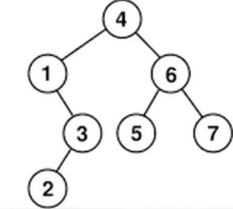

# ÁRVORE

Os elementos da árvore podem ter mais de um ponteiros apontando para o próximo elemento.

## Ancestralidade

### Raiz
O primeiro elemento da árvore.

### Pai
É o ancestral mais próximo. A raiz é o único nó sem pai.

### Filho
x é filho de y se ele é um descendente direto.

### Nó folha:
É um elemento que não tem um ponteiro apontando pro próximo elemento. 

### Nó interno
Tem um ponteiro apontando para o próximo elemento.

## Altura e Profundidade

### Altura
Distância do maior caminho até uma folha.
Altura da raiz é a altura da árvore.

### Profundidade
Distância do nó até a raiz.

## Árvore Binária
É uma árvore que cada nó tem no máximo 2 filhos.

### Árvore Binária de busca
Uma árvore binária é dita de busca, se para cada um de seus nós, temos que o elemento deste nó é maior que todos os elementos dos nós da sub árvore à sua esquerda, e menro que todos os elementos dos nós da sub árvore à sua direita.

### Árvore Binária de busca -> Inserção
 Se a raiz for nula, o elemento será inserido nela.
 Se não, ele caminha a árvore perguntando se os elementos são menores ou maiores que ele, e assim, definindo o seu caminho até encontrar um espaço vazio.

### Árvore Binária de busca -> Busca
Primeiro compara o elemento com a raiz, se for menor vai pra esquerda, se for maior vai para direita, recursivamente.
As duas formas de parar a busca é quando o elemento ou um espaço vazio forem encontrados.315
Para remover um nó é preciso buscar ele primeiro.
 
#### Caso 1 -> Nó folha
Para deletar um nó folha é necessário colocar NULL no ponteiro do pai que está apontando pra ele.

#### Caso 2 -> Nó com apenas um filho
Para deletar um nó com apenas um filho é necessário fazer o ponteiro do pai que anteriormente apontava pra ele, apontar pro filho dele.

#### Caso 3 -> Nó com dois filhos
Para deletar um nó com dois filhos é necessário buscar o seu sucessor para substituir o lugar do nó removido, deletar o nó antigo do sucessor, e colocar NULL no ponteiro do pai que estava apontando pra ele.
Esse sucessor pode ser o menor elemento da direita ou o maior elemento da esquerda.
Se esse nó tiver um filho, fazer a mesma coisa do caso 2.

## Percurso 
É a iteração de todos os nós de uma árvore de uma forma organizada.

### Em Ordem
O filho esquerdo é visitado primeiro, depois o nó pai e por fim o filho direito. Essa técnica é comumente utilizada para obter os elementos de uma árvore binária de busca em ordem crescente.
A ordem da árvore binária acima fica: 1,2,3,4,5,6,7

### Pré Ordem
O nó pai é visitado primeiro, depois o filho esquerdo e por fim o filho direito. O nó pai é visitado antes de todos os filhos dele. Essa técnica é útil para criar uma cópia da árvore ou para realizar operações de pré-processamento antes de visitar os nós filhos. A ordem da árvore binária acima fica: 4,1,3,2,6,5,7

### Pós Ordem
O filho esquerdo é visitado primeiro, depois o filho direito e por fim o nó pai. O nó pai é visitado após todos os filhos dele. Essa técnica é frequentemente empregada em cálculos que requerem informações dos nós filhos antes de processar o nó pai, como a avaliação de expressões aritméticas. A ordem da árvore binária acima fica: 2,3,1,5,7,6,4

