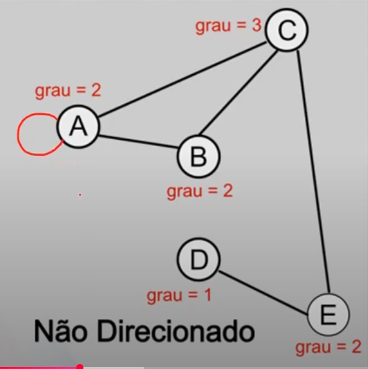
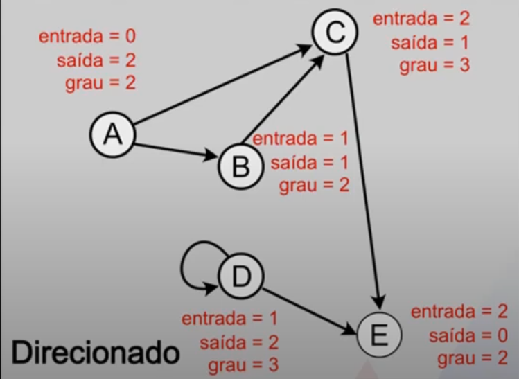
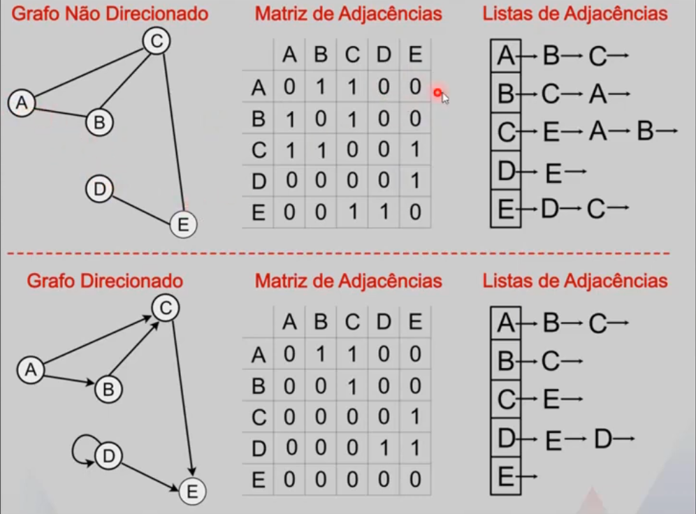
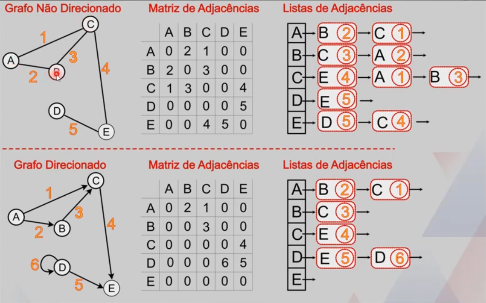

# GRAFOS
Um grafo é um conjunto de vértices e arestas, em que cada aresta conecta dois vértices.
Um grafo é um par de conjuntos G = (V,A), em que V é o conjunto de vértices e A é o conjunto de arestas.
Cada nó pode ter pais e filhos ilimitados.
As árvores são casos particulares de grafos.

## Ordem 
A ordem de um grafo é a quantidade de vértices que ele possui.

## Passeio
É uma sequência de arestas do tipo (v0, v1), (v1, v2), (v2, v3), ... (vs-1, vs).
v0 é o início do passeio e vs é o fim.
s é comprimento do passeio.
Grafos direcionados são mais limitados a fazer passeios.

## Grau
O número de vezes que as arestas incidem sobre o vértice v é chamado grau do vértice v.

## Grafo direcionado
Arestas tem direção, a aresta (6A, 7A) não é a mesma aresta (7A, 6A), a ordem da escrita da aresta faz diferença.
O 6A pode ir até a, mas não necessariamente pode voltar.

### Grau - Grafo direcionado
No caso de grafos direcionados, cada vértice terá um grau de entrada (quantidade de arestas que entram no vértice) e um grau de saída (quantidade de arestas que sam de um vértice).
O grau é a soma do grau de entrada com o grau de saída.₢

## Grafo não direcionado
Arestas não tem direção, a aresta (6A, 7A) é a mesma aresta (7A, 6A), a ordem da escrita da aresta não faz diferença.
O 6A pode ir até a e voltar.

## Laço
Quando uma aresta sai de um vértice e volta para ele mesmo.

## Grafo simples
Um grafo simples é um grafo que não tem laços ou arestas múltiplas (ou paralelas).

## Representações de um grafo

### Representação gráfica

### Relação de vértices e arestas

### Matriz de adjacências
= O grau de entrada de um grafo direcionado é verificado pela coluna, enquanto o grau de saída é verificado na linha.
- Quando um grafo é denso (tem muitas arestas), a matriz de adjacências é boa.

### Listas de adjacências
- Ótimas para grafos direcionados.
- Quando um grafo é esparso (tem poucas arestas), a listas de adjacências é boa.

## Grafos ponderados
Dependendo do caminho feito, pode ser mais ou menos custoso.

## Buscas

### Busca em profundidade
A busca em profundidade explora o grafo indo o mais fundo possível em cada caminho antes de voltar. Para isso, utiliza uma pilha, garantindo que os últimos nós adicionados sejam processados primeiro.
Vai achar um dos caminhos possíveis, não necessariamente o melhor caminho.

#### Passo a passo:
1. Começa colocando a raiz (A) na base da pilha.
2. Se A não for o nó buscado, remove-o da pilha e adiciona seus filhos (B e C).
3. Em vez de processar o primeiro filho adicionado (B), pega o último (C) e continua descendo.
4. Explora todos os filhos e netos de C antes de voltar e explorar os filhos de B.
5. O processo se repete até encontrar o nó desejado ou visitar todos os vértices acessíveis.

### Busca em largura
A busca em largura explora todos os vizinhos de um nó antes de avançar para o próximo nível. Para isso, utiliza uma fila, garantindo que os vértices sejam visitados em ordem de proximidade.
Vai achar o melhor caminho possível em mínimo de arestas percorridas.

#### Passo a passo:
1. Começa pelo nó raiz (A) e o coloca na fila.
2. Se A não for o nó buscado, adiciona seus filhos (B e C) à fila.
3. Remove A da fila. Agora, os próximos na fila são B e C.
4. O próximo a ser processado é B (o primeiro da fila).
5. Se B não for o nó buscado, adiciona seus filhos (D e E) à fila.
6. Continua o processo até encontrar o nó desejado ou visitar todos os vértices acessíveis.

## Exemplos
- Conexões de amizades em redes sociais, cada pessoa seria um vértice e cada conexão seria uma aresta.
- Uma rede de computadores.
- Caminhos percorridos em um metrô.