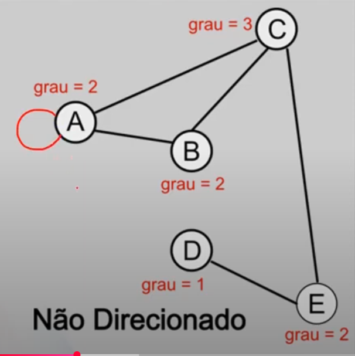
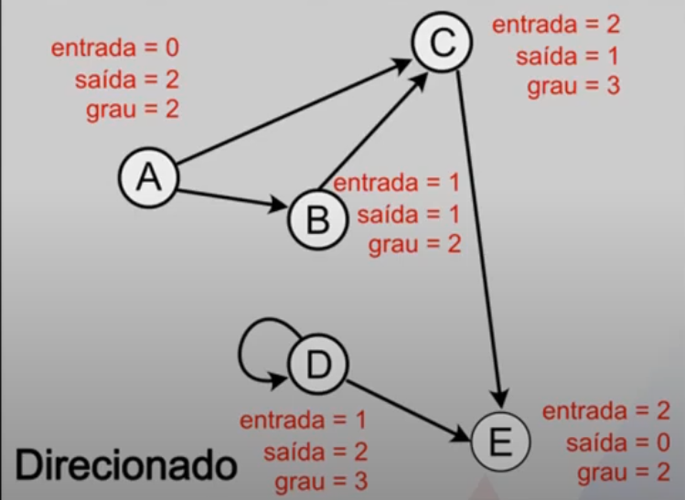
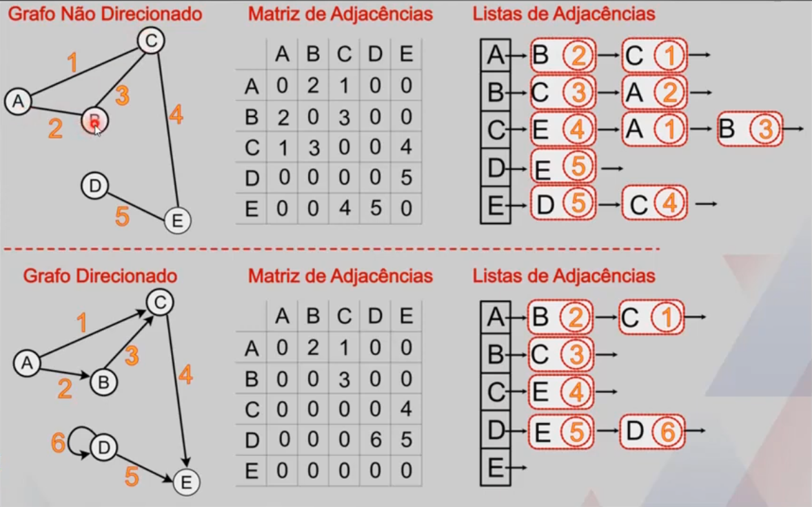

# GRAFOS
Um grafo é um conjunto de vértices e arestas, em que cada aresta conecta dois vértices.
Um grafo é um par de conjuntos G = (V,A), em que V é o conjunto de vértices e A é o conjunto de arestas.
Cada nó pode ter pais e filhos ilimitados.
As árvores são casos particulares de grafos.

## Ordem 
A ordem de um grafo é a quantidade de vértices que ele possui.

## Passeio
É uma sequência de arestas do tipo (v0, v1), (v1, v2), (v2, v3), ... (vs-1, vs).
v0 é o início do passeio e vs é o fim.
s é comprimento do passeio.
Grafos direcionados são mais limitados a fazer passeios.

## Grau
O número de vezes que as arestas incidem sobre o vértice v é chamado grau do vértice v.

## Grafo direcionado
Arestas tem direção, a aresta (6A, 7A) não é a mesma aresta (7A, 6A), a ordem da escrita da aresta faz diferença.
O 6A pode ir até a, mas não necessariamente pode voltar.

### Grau - Grafo direcionado
No caso de grafos direcionados, cada vértice terá um grau de entrada (quantidade de arestas que entram no vértice) e um grau de saída (quantidade de arestas que sam de um vértice).
O grau é a soma do grau de entrada com o grau de saída.₢

## Grafo não direcionado
Arestas não tem direção, a aresta (6A, 7A) é a mesma aresta (7A, 6A), a ordem da escrita da aresta não faz diferença.
O 6A pode ir até a e voltar.

## Laço
Quando uma aresta sai de um vértice e volta para ele mesmo.

## Grafo simples
Um grafo simples é um grafo que não tem laços ou arestas múltiplas (ou paralelas).

## Representações de um grafo

### Representação gráfica

### Relação de vértices e arestas

### Matriz de adjacências
= O grau de entrada de um grafo direcionado é verificado pela coluna, enquanto o grau de saída é verificado na linha.
- Quando um grafo é denso (tem muitas arestas), a matriz de adjacências é boa.

### Listas de adjacências
- Ótimas para grafos direcionados.
- Quando um grafo é esparso (tem poucas arestas), a listas de adjacências é boa.

## Grafos ponderados
Dependendo do caminho feito, pode ser mais ou menos custoso.

## Exemplos
- Conexões de amizades em redes sociais, cada pessoa seria um vértice e cada conexão seria uma aresta.
- Uma rede de computadores.
- Caminhos percorridos em um metrô.